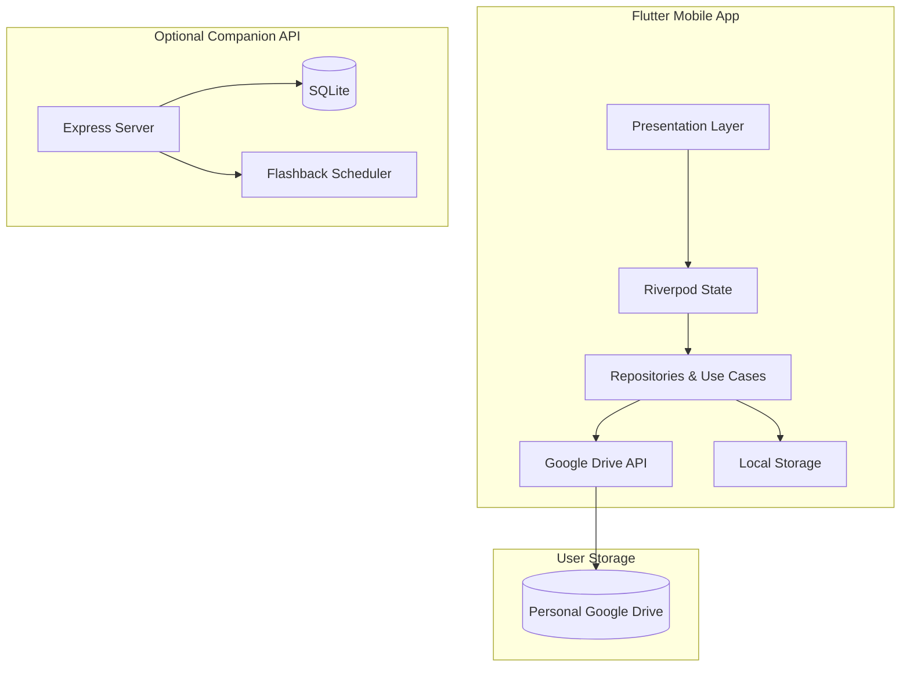

<div align="center">


# Kioku · 記憶

### *Your private scrapbook for the people who matter most.*

*A warm, local-first memory album for the people you love.*

<br>

[](https://flutter.dev)
[](https://dart.dev)
[](https://nodejs.org)
[](https://riverpod.dev)
[](LICENSE)

### 🌸 Preserve moments, not posts.

[**Download APK**](releases/kioku-release.apk) • [Release Notes](releases/README.md)

</div>

---

# ✨ Why Kioku?

Most apps are built for sharing with everyone.

**Kioku is built for remembering with someone.**

Whether it's a late-night coffee date, your family's annual vacation, or tiny everyday moments with your best friend, Kioku turns photos and videos into a beautiful shared scrapbook—without feeds, likes, or algorithms.

Inspired by Japanese stationery and handmade journals, every memory feels intentional, tactile, and deeply personal.

> **記憶 (Kioku)** — *the Japanese word for memory.*

---

# 🌷 The Experience

<div align="center">

| Coffee Light | Forest Dark |
|:--:|:--:|
| Warm cream paper & latte tones | Deep moss, charcoal & amber |

</div>

### A scrapbook that feels handcrafted

- 📜 Washi tape accents and paper textures
- 🪵 Claymorphism with soft tactile shadows
- 🏮 Traditional Japanese **Hanko** ink stamps
- ✍️ Elegant typography inspired by printed journals
- 🌙 Beautiful light & dark themes designed as matching stationery sets

Instead of scrolling through endless posts, Kioku feels like opening a treasured photo album.

---

# 💛 Designed for meaningful memories

### 📸 Capture Moments

Save photos and videos into beautifully organized albums shared with the people you love.

### 🕰️ Relive the Past

Kioku automatically resurfaces forgotten memories through gentle flashbacks.

| Feature | Description |
|---------|-------------|
| 🌸 **One Year Ago Today** | Revisit memories captured on the same date |
| 🍂 **Last Month's Album** | A curated retrospective of the previous month |
| ✨ **Passing Memory** | Weekly highlights that quietly return for a moment |

### 👥 Share privately

Invite friends or family using their Google account. Albums remain collaborative without becoming public social media.

---

# 🔒 Privacy by Design

Kioku follows a **local-first, user-owned** philosophy.

Unlike traditional photo apps, your media is **never stored on our servers**.

| Your Data | Where it lives |
|-----------|----------------|
| Photos & Videos | 📁 Your own Google Drive |
| Offline Albums | 📱 Your device |
| Shared Albums | 🤝 Google Drive permissions |
| Central Media Storage | ❌ None |

**Your memories belong to you—not to an algorithm.**

---

# 🏗 Architecture

Kioku consists of a Flutter mobile application and an optional Node.js companion backend.



### Mobile

- **Flutter 3**
- **Dart 3**
- **Riverpod 2.6**
- **GoRouter**
- **Photo View**
- **Video Player + Chewie**

### Backend

- **Node.js + Express**
- **SQLite (sql.js)**
- **JWT Authentication**
- **node-cron**
- **Google Drive API v3**

---

# 📂 Project Structure

```text
Kioku
│
├── flutter_mobile/
│   ├── lib/
│   │   ├── core/
│   │   ├── features/
│   │   ├── shared/
│   │   ├── app_router.dart
│   │   └── main.dart
│   └── assets/
│
├── backend/
│   ├── routes/
│   ├── services/
│   ├── middleware/
│   ├── __tests__/
│   └── server.js
│
├── assets/
├── start.py
└── README.md
```

---

# 🚀 Getting Started

## Prerequisites

- Flutter 3.11+
- Dart 3
- Node.js 18+
- Python 3.9+
- Android Studio

## One-click development

```bash
python start.py
```

The launcher automatically:

- Starts the backend
- Boots the Android emulator
- Reverse-forwards ports
- Builds & launches the Flutter app

---

## Manual Setup

### Backend

```bash
cd backend
npm install

cp .env.example .env

npm start
```

Runs at:

```text
http://localhost:4000
```

### Flutter

```bash
cd flutter_mobile

flutter pub get
flutter run
```

---

# ☁ Google Drive Setup

Kioku can run entirely offline, but Google Drive enables seamless private syncing.

1. Create a Google Cloud project
2. Enable **Google Drive API**
3. Configure OAuth Consent
4. Add scope:

```text
https://www.googleapis.com/auth/drive.file
```

5. Create an Android OAuth client
6. (Optional) Generate a backend refresh token

---

# 🧪 Testing

### Flutter

```bash
flutter analyze
flutter test
```

### Backend

```bash
cd backend
npm test
```

---

# 🌸 Philosophy

> **The best memories aren't the loudest ones.**

Kioku was created around a simple idea:

Digital memories should feel as comforting as opening an old scrapbook—filled with paper, ink, photographs, and the people who make those moments meaningful.

No feeds. No followers. Just memories.

---

<div align="center">

### Made with ❤️ for meaningful moments

**Kioku · 記憶**

</div>
