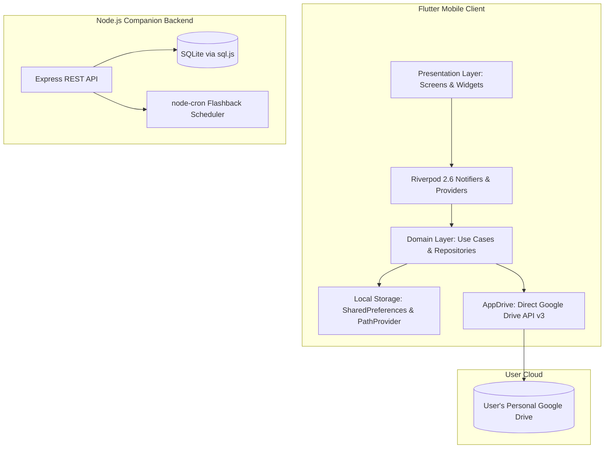

<div align="center">


# Kioku · 記憶
### *A warm, private shared memory album and time capsule for close friend groups and couples.*

[](https://flutter.dev)
[](https://dart.dev)
[](https://nodejs.org)
[](https://expressjs.com)
[](https://riverpod.dev)
[](LICENSE)

</div>

---

## 📖 Overview

**Kioku** (記憶, Japanese for *"memory"*) is a cozy, tactile memory-keeping application crafted specifically for small circles—couples, best friends, and family. Rather than broadcasting life onto algorithmic social media feeds, Kioku turns moments into intimate digital scrapbooks reminiscent of handcrafted Japanese stationery.

Your photos and videos stay strictly yours. Kioku adopts a **local-first and user-owned storage philosophy**: media files live in each user's personal **Google Drive** or on-device storage. There are no centralized storage servers, no third-party cloud lock-in, and no data mining.

---

## ✨ Features

### 🌸 Japanese Stationery Aesthetic
- **Washi Tape & Hanko Stamps**: Organic visual postmarks with Japanese design motifs and ink textures.
- **Claymorphism**: Soft, tactile cards with gentle debossed and elevated clay shadows.
- **Curated Themes**:
  - ☕ **Coffee Light**: Cream paper, warm sepia ink, toasted latte tones.
  - 🌲 **Forest Dark**: Deep moss, charcoal slate, warm amber embers.

### 🕰️ Smart Flashback Engine
- **"1 Year Ago Today"**: Relive what happened on this exact calendar day in years past.
- **"Last Month's Album"**: A retrospective highlight reel of memories captured during the previous month.
- **"A Passing Memory"**: Ephemeral weekly highlights from the past 7 days.

### 📸 Rich Media Experience
- High-resolution photo viewer with pinch-to-zoom and pan gestures via `photo_view`.
- Video playback support with custom playback controls via `video_player` and `chewie`.
- Day-grouped timeline feed sorting moments automatically into neat daily chapters.

### 🔒 User-Owned & Local-First Storage
- **Google Drive Integration**: Each album is represented as a Google Drive folder (`Kioku · <Album Name>`).
- **Offline / Local Mode**: Seamless guest and offline mode allowing users to save and browse albums stored directly on device.
- **Selective Sharing**: Share albums with friends using standard Google Drive permissions—simply enter their email.

---

## 🏗️ Architecture & Tech Stack

Kioku is divided into a **Flutter Mobile App** client and an optional **Node.js Companion Backend**:



### 📱 Flutter Mobile (`flutter_mobile`)
- **Framework**: Flutter 3.x / Dart 3.x
- **State Management**: [Riverpod 2.6](https://riverpod.dev) (`AsyncNotifier`, `StateNotifier`, clean dependency injection)
- **Routing**: [GoRouter](https://pub.dev/packages/go_router) with stateful nested shell routes (`StatefulShellRoute`) and smooth page transitions
- **Design Tokens**: Custom typography (Fraunces & Inter), Clay shadows, Washi tape shaders, and Hanko stamps
- **Cloud & Auth**: `google_sign_in`, `googleapis`, `googleapis_auth`

### ⚡ Companion Backend (`backend`)
- **Runtime**: Node.js, Express.js
- **Database**: Zero-dependency SQLite powered by `sql.js`
- **Security**: `helmet`, `express-rate-limit`, JWT session tokens
- **Batch Jobs**: `node-cron` scheduled flashback generation

---

## 📁 Repository Structure

```
Kioku/
├── assets/                          # Shared root assets (e.g. Kioku logo)
│   └── kiokulogo.jpg
├── backend/                         # Node.js backend companion
│   ├── __tests__/                   # Jest test suites (auth, flashbacks)
│   ├── middleware/                  # Auth and error handling middleware
│   ├── routes/                      # Express API routes (auth, media, flashbacks)
│   ├── scripts/                     # Helper scripts (Google OAuth token generation)
│   ├── services/                    # Google Drive v3 wrapper
│   ├── db.js                        # SQLite database engine
│   ├── flashbackJob.js              # Scheduled cron job for flashback bucketing
│   ├── package.json                 # Backend dependencies & test scripts
│   ├── server.js                    # Express app entry point
│   └── .env.example                 # Environment variables template
├── flutter_mobile/                  # Flutter application
│   ├── assets/                      # Flutter app assets (kiokulogo.jpg)
│   ├── lib/
│   │   ├── core/                    # Theme, Drive API, models, providers, storage
│   │   ├── features/
│   │   │   ├── auth/                # Sign-in & identity presentation / domain
│   │   │   ├── feed/                # Day-grouped timeline feed & memory cards
│   │   │   ├── flashbacks/          # Time-travel memory collections
│   │   │   ├── media_viewer/        # Full-screen photo & video players
│   │   │   ├── profile/             # Album management & settings
│   │   │   └── upload/              # Media picker & upload workflow
│   │   ├── shared/widgets/          # Washi tape, clay card, hanko stamp, nav bar
│   │   ├── app_router.dart          # GoRouter navigation schema
│   │   └── main.dart                # App entrypoint & theme initialization
│   ├── test/                        # Flutter unit & widget tests
│   └── pubspec.yaml                 # Flutter packages & asset configuration
├── start.py                         # One-click dev environment runner
├── .gitignore                       # Repository-wide ignore rules
└── README.md                        # Documentation
```

---

## 🚀 Getting Started

### Prerequisites
- [Flutter SDK](https://docs.flutter.dev/get-started/install) (v3.11+ recommended)
- [Node.js](https://nodejs.org/) (v18 or newer)
- [Python](https://www.python.org/) 3.9+ (for `start.py` orchestrator)
- [Android Studio](https://developer.android.com/studio) with an Android Emulator or physical device

---

### Option 1: One-Click Dev Launcher (`start.py`)

Kioku includes an automated python script that starts the Node backend, powers up the Android emulator, reverse-forwards necessary ports, builds the debug APK, and launches the app:

```bash
python start.py
```

---

### Option 2: Manual Setup

#### 1. Backend Setup
```bash
cd backend
npm install

# Copy environment template and configure secrets
cp .env.example .env

# Run the backend server (starts on http://localhost:4000)
npm start
```

#### 2. Mobile App Setup
```bash
cd flutter_mobile

# Fetch packages
flutter pub get

# Launch on connected device / emulator
flutter run
```

---

## 🔑 Google Drive & OAuth Configuration

If you wish to synchronize albums to your Google Drive account:

1. Create a project in the [Google Cloud Console](https://console.cloud.google.com/).
2. Enable the **Google Drive API**.
3. Configure the **OAuth Consent Screen** and add the following scope:
   - `https://www.googleapis.com/auth/drive.file`
4. Create an **Android OAuth Client ID** using your debug SHA-1 fingerprint (`gradlew signingReport`).
5. (Optional for backend sync): Run `node scripts/getRefreshToken.js` in the `backend/` directory to generate a permanent refresh token.

*Note: You can also use Kioku completely offline in **Guest / Local Mode** without configuring Google credentials.*

---

## 🧪 Testing & Verification

Kioku has comprehensive test coverage across both frontend and backend:

### Mobile Tests
```bash
cd flutter_mobile

# Run all widget and unit tests
flutter test

# Run static analysis
flutter analyze
```

### Backend Tests
```bash
cd backend

# Run Jest test suites
npm test
```

---

## 📄 License

This project is licensed under the [MIT License](LICENSE).
